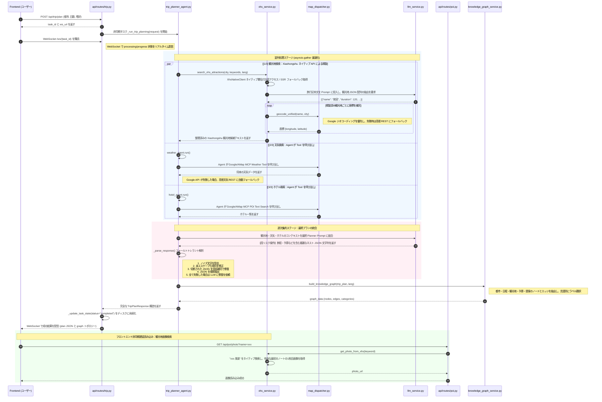

# TripStar - AI 旅行エージェント


> **HelloAgents フレームワークに基づくマルチエージェント連携の旅行計画プラットフォーム**

<p align="center">
  
  
  
  
  
  
</p>

<div align="center">

[🇨🇳 中文](README.md) | [🇺🇸 English](README_en.md) | [🇯🇵 日本語](README_ja.md)

</div>

> [!IMPORTANT]
> 
> プロジェクトをオンライン上で直接体験できます。完全な機能を体験するにはローカルでのデプロイが推奨されます。**リスク管理の影響により、オンライン体験版ではXiaohongshu (RED) には接続していません**：[TripStar - AI 旅行エージェント](https://modelscope.cn/studios/lcclxy/Journey-to-the-China)
> 
> 含まれる機能：旅行プラン、観光地マップの概要、予算の詳細、日別旅程設計：旅程説明、交通手段、宿泊オプション、観光地スケジュール（住所、滞在時間、観光地の説明、予約リマインダー）、食事プラン、天気情報、ナレッジグラフの可視化、没入型 AI Q&A アシスタント...

## プロジェクト概要

**TripStar** は革新的な AI 旅行エージェントアプリケーションであり、HelloAgents フレームワークに基づくマルチエージェント協調の旅行計画プラットフォームです。ユーザーが旅行を計画する直面する「情報過多」や「決断疲れ」の問題を解決することを目指しています。

従来の旅行ガイドウェブサイトとは異なり、このプロジェクトは **大規模言語モデル (LLM)** と **マルチエージェント (Multi-Agent)** に基づく革新的なモデルを採用しています。経験豊富な人間の旅行バトラーのように、ユーザーのパーソナライズされたニーズ（交通手段、宿泊スタイル、旅行の興味、特別なリクエストなど）を包括的に考慮し、旅行情報を自動で検索し、現地の天気をチェックし、ホテルを厳選し、最適なルートを計画して、**迅速に旅行計画を立てます**。

### コアのハイライト

* **Xiaohongshu (RED) のディープな統合**: 観光地の推薦や旅行ガイドデータは、Xiaohongshu の実際のユーザー旅行記から直接取得されます。その後、LLM によってインテリジェントに精製され、最も本物の注意点やチェックインの推奨事項を得ます。観光地の画像も Xiaohongshu 経由でリアルタイムで取得され、ユーザーが最近撮影した本物の風景写真が表示されます。
* **観光地の予約リマインダー**: Xiaohongshu の旅行記で言及されている、事前予約が必要な観光地（故宮博物院や陝西歴史博物館など）を自動で識別し、旅程カードにわかりやすく予約プロンプトと予約チャンネルを表示し無駄足を未然に防ぎます。
* **多言語 & 国際化対応**: Vue I18n を深く統合し、さらに LLM のプロンプトレベルおよびナレッジグラフのデータレベルの両方でネイティブの言語ローカライゼーションをサポートします。システムUIおよびAIのQ&Aは複数の言語（中国語/英語/日本語）間をシームレスに切り替えることができ、生成された旅行計画もターゲット言語に動的に翻訳されるため、世界中の旅行者の言語の壁を取り払います。
* **デュアルエンジンハイエンドインタラクティブマップ**: **Google Maps** と **高徳地図 (AMap)** のデュアルエンジンの切り替えと自動のフォールバックを深く統合してサポートしています。国外では Google Mapsを使用し、国内では高徳の地図にフォールバックします。「出発地 - 観光地 - 目的地」のリアルな緯度・経度のルートを動的に描画し、カスタマイズされた背景色を提供し、予定を調整しやすくするための観光地の位置の即時プレビューを提供します。
* **正確な予算詳細パネル**: チケット、食事代、宿泊代、交通費などの多面的な費用をインテリジェントに集計し、旅行予算を把握するための直感的な財務パネルとして提供します。
* **マルチエージェント協調**: 天気予報士やホテル推薦専門家など、異なる役割のエージェントを用いて、協力なワークフロー (Workflow) を通じて複雑な旅行計画タスクを共同で達成します。
* **ナレッジグラフの可視化**: 生成された旅程データをリアルタイムでノードとリレーションシップのグラフに変換し、「都市 - 日数 - 旅程ノード - 予算」の空間構造を直感的に表示します。
* **没入型 AI Q&A コンパニオン**: 報告書の生成後、左下にフローティングの AI Q&A ウィンドウが提供されます。AI は完全な旅程のコンテキスト情報を保持しており、ユーザーはいつでもチケット料金やルートの適しさなどの旅程の詳細について質問できます。
* **マルチシティ旅行計画**: 一度の旅行で複数の都市を計画できます。都市を動的に追加し、それぞれの滞在日数を設定すると、システムが自動で総旅行日数を計算します。都市間移動日には交通手段の提案がスマートに表示され、予算パネルでは都市間交通費が別途集計され、天気パネルは都市ごとに表示され、ナレッジグラフはマルチシティのトポロジーを完全に表現します。
* **ユーザー嗜好メモリ**: 重み付きのユーザー専用旅行嗜好メモリを内蔵し、忘却メカニズムと TOP-K 召回に対応します。有効化すると、旅程生成後に安定した嗜好を自動抽出・採点して保存し、次回以降の Agent Prompt に高重みの嗜好を注入することで、推薦をユーザー習慣に継続的に近づけます。
* **ラグジュアリーなダークグラスモーフィズムデザイン**: 新しく設計されたダークグラスモーフィズム (Dark Luxury Glassmorphism) アプリのインターフェースにより、没入感のあるハイエンドな視覚体験を提供します。

---

## システムアーキテクチャ

本プロジェクトは標準的なフロントエンド・バックエンド分離アーキテクチャを採用し、Vue フロントエンド操作層、FastAPI バックエンドサービス層、LLM/Agents による知的推論層で構成されています。



---

## クイックインストールとデプロイメントガイド

### 環境の準備

* Python 3.10+
* Node.js 18+
* 大規模言語モデル API キー（OpenAIと互換性のあるものを推奨。Doubao など）
* 高徳マップ (AMap) のキー：バックエンド REST サービス用の Web Service Key、フロントエンド地図表示用の Web JS API Key、AMap JS API 2.0 用の Security JSCode。Security JSCode は必須ですが、`.env` / Docker ルート `.env` の `VITE_AMAP_SECURITY_JS_CODE` に記入してください。フロントエンドの dev/build 時に Vite が `index.html` のプレースホルダーを自動置換します。実際のキーを `index.html` に直接ハードコードしないでください。Google Mapsを使用する場合、Google Cloudコンソールで **Geocoding API, Places API (New), Directions API, Maps JavaScript API, Weather API** を必ず有効にし、有効な課金アカウント（クレジットカード）をリンクする必要があります。
* Xiaohongshu の Cookie（ブラウザにログイン後、DevToolsで取得）
* `uv` パッケージマネージャーのインストール

### Docker / Compose 構成の規約

docker-compose を介してプロジェクト（フロントエンドおよびバックエンドの両方）をワン・クリックで開始することを強く推奨します。まずルートの設定テンプレートをコピーし、起動前に `.env` の変数を設定してください。

```bash
cp .env.example .env
```

* コンテナーの起動時にバックエンドは `backend/.env` を読み取りません。構成は常に環境変数で渡してください。
* `docker-compose.yaml` は本番プロキシや API キーの設定（例：`GOOGLE_MAPS_API_KEY`、`GOOGLE_MAPS_PROXY` の引き渡し）をサポートします。`GOOGLE_MAPS_PROXY` はバックエンドの Google Maps サービス専用で、LLM、Xiaohongshu、高徳リクエストには影響しません。
* フロントエンドのビルド時変数 `VITE_AMAP_WEB_JS_KEY` と `VITE_AMAP_SECURITY_JS_CODE` は `build.args` 経由で注入されます。変更後はイメージの再ビルドが必要です。
* フロントエンドの設定画面から、LLM、Xiaohongshu、高徳 Web Service Key、Google Maps Key/プロキシなどのバックエンド実行時設定を更新できます。機密値は API レスポンスではマスクされ、マスク値のまま保存した場合は既存の値が保持されます。

ルート `.env` の例：

```env
LLM_API_KEY=your_api_key
LLM_BASE_URL=https://your-openai-compatible-endpoint/v1
LLM_MODEL_ID=your_model
XHS_COOKIE="a1=xxx; web_session=xxx"
VITE_AMAP_WEB_KEY=your_amap_web_service_key
VITE_AMAP_WEB_JS_KEY=your_amap_web_js_key
VITE_AMAP_SECURITY_JS_CODE=your_amap_security_js_code
GOOGLE_MAPS_API_KEY=
GOOGLE_MAPS_PROXY=
```

**ワンストップの起動コマンド:**
```bash
# ビルドを行い、バックグラウンドでのコンテナ起動
docker-compose up -d --build

# ログを表示
docker-compose logs -f
```

### ローカル開発の手順

#### 1. バックエンドの起動

```bash
# バックエンドのディレクトリに移動
cd backend

# Xiaohongshu用Node.js 依存関係をインストール
npm install

# uv で仮想環境を作成
uv venv .venv

# 仮想環境をアクティベート
source .venv/bin/activate  # Windows: .venv\Scripts\activate

# プロジェクトの依存関係をインストール
uv pip install -r requirements.txt

# .env に API KEY などを記入
cp .env.example .env
# [必須] LLM_API_KEY, LLM_BASE_URL, LLM_MODEL_ID
# [必須] VITE_AMAP_WEB_KEY（バックエンド REST サービス用の高徳 Web Service Key）
# [必須] XHS_COOKIE
# [任意] GOOGLE_MAPS_API_KEY, GOOGLE_MAPS_PROXY
#        GOOGLE_MAPS_PROXY はバックエンド Google Maps サービス専用です。

# FastAPIを起動 
uvicorn app.api.main:app --host 0.0.0.0 --port 8000 --reload
```

#### 2. フロントエンドの起動

```bash
# フロントエンドに移動
cd frontend

# npmで依存関係のインストール
npm install

# 設定ファイルをコピーし、Key を記入
cp .env.example .env
# [必須] VITE_AMAP_WEB_JS_KEY
# [必須] VITE_AMAP_SECURITY_JS_CODE
# [任意] VITE_API_BASE_URL。デフォルトは http://localhost:8000。同一オリジン配信では空でも可。

# Viteサーバーの起動
npm run dev
```
> 以下は一部の実行結果で、豊富な機能を探索中です...


## 今後の最適化の方向
- [x] ~~Xiaohongshuとの連携~~
- [x] ~~Xiaohongshuからの観光地画像の利用~~
- [x] ~~予約の事前リマインダー連携~~
- [x] ~~Google Maps統合と自動的なデュアルエンジン降格のフォールバック~~
- [x] ~~多言語推論モデル適応とディープなナレッジグラフの国際化~~
- [x] ~~歴史的な計画機能~~
- [x] ~~エンタープライズ HTTP/SOCKS5 プロキシ構成サポート~~
- [x] ~~エクスポートのレイアウトと地図の最適化~~
- [x] ~~マルチ都市の旅行計画構成~~
- [ ] グルメ・おすすめレストランの詳細な強化

## 🙏 謝辞
TripStarの改良において交流およびフィードバックをしていただいた [linuxdo](https://linux.do/) コミュニティに感謝します。
